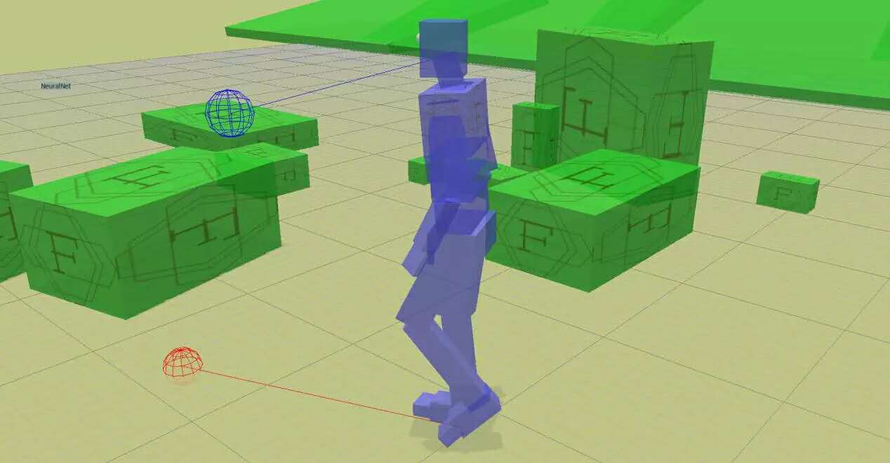

LSD_SLAM 机器人开发
</br>很多人曾经梦想着为自己热爱的事业奋斗，但是绝大多数人都会因为主动或者被动的原因而失去斗志。我跟[克雷格-赛格](https://bbs.hupu.com/20968906.html?from=hao123)找到了共鸣， 希望在我临死的时候，我能够说：我的整个生命和全部精力，都已经献给世界上最壮丽的事业————为让机器人能够更好的理解世界，改变世界从而为千家万户服务的伟大事业而斗争。
===================================
1.lsd_slam_core与lsd_slam_viewer之间的ROS交互
-----------------------------------
### (1).core发布消息，viewer接受消息
core发布消息的函数都在/lsd_slam_core/src/IOWrapper/ROS/ROSOutput3DWrapper.cpp::70中，
```    	virtual void publishKeyframeGraph(KeyFrameGraph* graph);
	// publishes a keyframe. if that frame already existis, it is overwritten, otherwise it is added.
	virtual void publishKeyframe(Frame* f);
	// published a tracked frame that did not become a keyframe (i.e. has no depth data)
	virtual void publishTrackedFrame(Frame* f);
	// publishes graph and all constraints, as well as updated KF poses.
```
publishKeyframe()发布关键帧,填写id，时间戳，isKeyframe信息等等。
在SlamSystem::updateKeyframe()的最后对publishKeyframe()调用，就是说每更新一次关键帧，都会发布一次消息
### (2).New idea
车辆在行驶过程中，从机器人学角度来看它只有世界坐标(x,y,theta),如果摄像头是水平于地面安装，车辆与地面是刚体接触，pitch和roll角度变化不大，只有yaw的角度在时刻大幅度的变化，那么是否可以简化VSLAM算法，给SE3或SIM3加上约束，相机只有平动，在使用高斯牛顿或LM去优化位资的时候，旋转矩阵对应的旋转向量wn，sub to向量n=(x,y,0)。如果是这样的话，就可以大大简化SLAM的原始算法，甚至有可能跑在单片机这样的设备上。
### (3).Plan 2018.1-2018.3
    1.将所有投影点使用VBO显示在Robot map上
    2.使用哈希表存储栅格地图，手写list的A*算法
    3.手写二叉堆的A*算法
    4.计算机器人的实时pose(x,y,\theta)，调试反馈控制策略
### (4).Impression Drawing

